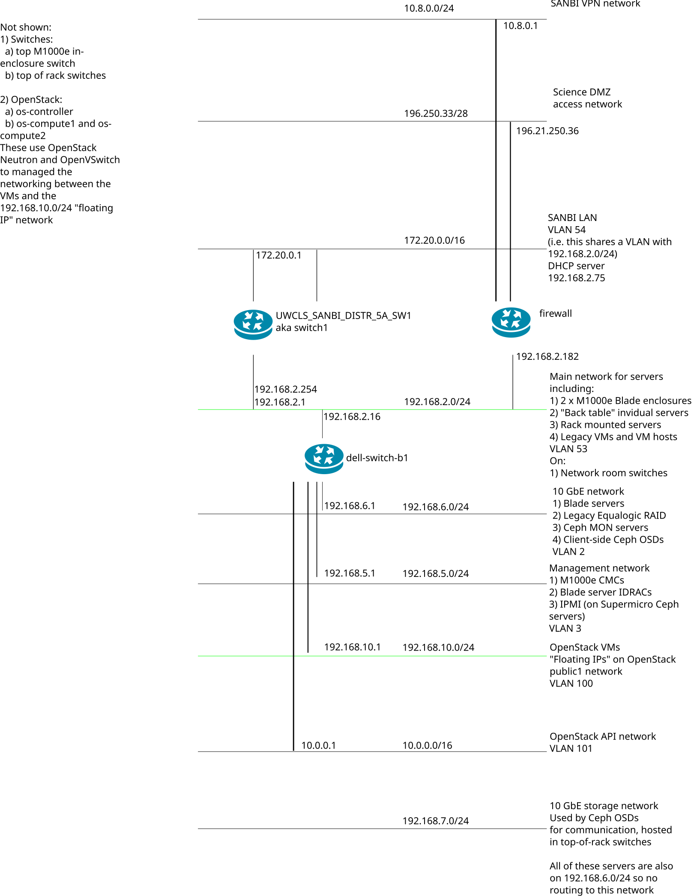

# SANBI opennms setup

This is largely based on roles from `mrlesmithjr` with a few tweaks:

1. The java role was replaced my own one to just install a recent JDK/JRE
2. nginx front end was added using the role from the Galaxy project

I also updated some things to install more recent postgresql. On the nginx side,
commander.sanbi.ac.za deploys a SSL cert / key to a path and the nginx role
configures nginx to go pick up that cert / key.

To install, just:

```bash
ansible -u ubuntu -i inventory opennms.yml
```

BTW a picture of the SANBI network is [here as a SVG](sanbi_network.svg) and below as a png:



(edit with Inkscape)